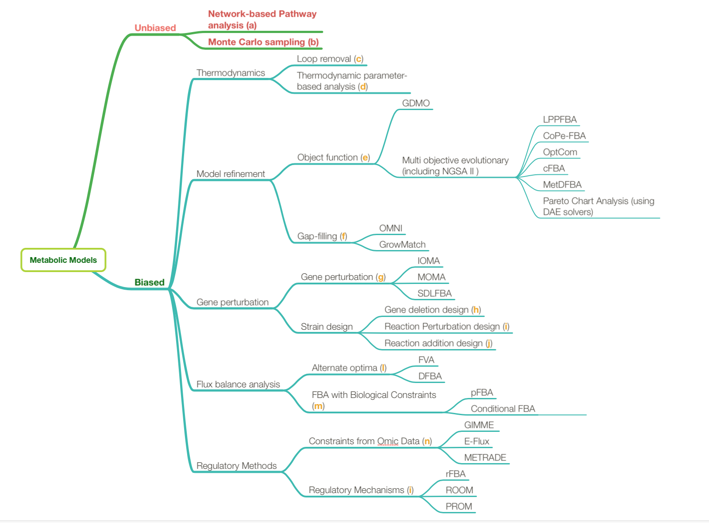

# Introduction

Metabolism is the indispensable set of biochemical reactions in a cell
which maintain its living state. Constraint-based reconstruction and
analysis (COBRA) are a group of techniques which are commonly used for
the mathematical and computational modelling of metabolic networks at
the whole genome scale. Genome-scale metabolic models are available in
online repositories such as the Kyoto Encyclopedia of Genes and Genomes
(KEGG) [@kanehisa2000kegg], the Biochemical Genetic and
Genomic (BiGG) knowledge-base [@schellenberger2010bigg],
the BioCyc collection of pathway/genome databases
[@karp2005expansion] and the ModelSEED
database[@henry2010high]. Principally, the preparation of a
genome scale metabolic model involves the reconstruction of all
metabolic reactions taking place in the organism supplemented with
functional annotation of genes, metabolites and pathways. Depending on
the quality of the reconstruction, processes of manual curation and
gap-filling may also be required. Many models also integrate signalling
and regulatory pathways with metabolic networks in order to add
information regarding underlying mechanisms, consequently improving flux
predictions [@palsson2015systems]. Predictions obtained
from genome-scale metabolic models can be reconciliated with *in-vivo*
findings and used to identify current gaps in our knowledge of
metabolism [@mienda2016genome]. There are often
inconsistencies between models and experimental data, such as when an
outcome is falsely predicted by the model (false positive) or when an
experimentally observed outcome is not predicted (false negative).
Algorithms such as Grow Match [@kumar2009growmatch], SMILEY
[@reed2006systems] and optimal metabolic network
identification (OMNI) [@herrgaard2006identification]
correct for such inconsistencies by suggesting adjustments for improving
model accuracy. In this way, reducing disparity between predicted and
experimentally measured fluxes presents opportunities to devise new
strategies for biological discovery [@o2015using].
Metabolic reconstruction via functional genomics (MIRAGE) conducts
gap-filling by integrating with functional genomics data to estimate the
probability of including each reaction from a universal database of
gap-filling reactions in the reconstructed network
[@vitkin2012mirage]. This enables selection of the set of
reactions whose addition is most likely to result in a fully functional
model when flux analysis is repeated.


(ref:trees) A forest of methods based on constraint-based reconstruction and
analysis (COBRA). (a) Network-based pathway analysis describes the
simplest configurations of metabolic pathways at steady state. (b) Monte
Carlo methods allow for uniform sampling of the solution space to
compute the flux as a probability distribution for each pathway in the
network. Thermodynamically infeasible fluxes may be eliminated using (c)
loop removal or (d) thermodynamic parameter-based analysis. Model
refinement may be carried out through (e) the selection of single or
multiple objectives or (f) gap-filling techniques. (g) Gene perturbation
helps to establish the essentiality of genes and the most efficient
pathways for the production of specific metabolites. Following this,
strain design for metabolic engineering may involve strategies for (h)
gene deletion (i) reaction perturbation or (j) reaction addition. (k)
Alternate optimal solutions may be yielded by variations of flux balance
analysis. Other variants may specify (l) the addition of specific
constraints or (m) their removal. Additional constraints may be
introduced through (n) the inclusion of multi-omic data or (o) gene
regulatory mechanisms.


The figure below (\@ref(fig:trees)) depicts our ’forest’ of methods commonly used
for constraint-based modelling of metabolic networks, following the
framework proposed by Lewis et al [@lewis2012constraining].
Approaches are broadly divided into biased and unbiased; the former
necessitates the definition of an objective function by the network
whereas the latter relies on determining a subset of statistically
analysable functional states whilst searching the entirety of the
solution space[@lee2009systems].

```{r trees, fig.cap='(ref:trees)', echo=FALSE}

```

