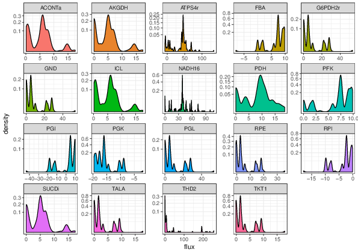

# Omic network integration: a critical perspective

A large proportion of techniques involve in multi-omic methods in
metabolic modelling involve using other omics to constrain the
metabolome: they are one way procedures. However, in order to properly
interpret the results of these procedures, techniques are required which
can integrate the different datasets together into something that is
easier to interpret than the separate datasets, and then provide
feedback on how those separate datasets affected the integrated dataset.
For example, in gene expression constrained flux balance analysis
methods, the genome and metabolome are integrated into a combined model
that tells us something more about feasible metabolic states, but the
resulting model is very complex and so the actual relationship between a
particular gene and a particular outcome can be hard to understand, even
though it is deterministic in the model. Additionally, there is a lack
of consensus about the best approach to take when estimating flux rates
in different conditions.

Any approach based upon flux balance analysis has an inherently linear
character: the outputs (whatever fluxes are of interest) are linearly
dependent on some subset of the inputs (the bounds and objective
function). The complexity comes from the fact that while the output is
only linearly dependent on a small fraction of the inputs in any given
configuration, all of the other inputs affect which subset this is. This
relationship is a piecewise linear equation with a large number of
terms, but where most of the coefficients are zero in any given piece.
This means that the challenge in understanding these models in an
intuitive way is not so much in understanding how each variable affects
the model, as when they do so.

When looking to understand the effects of genetic or proteomic data on
simulated phenotypes, naturally, the first place to start is at
techniques used for understanding the effects of genetic or proteomic
data on real phenotypes. Starting out with regression style techniques,
it becomes clear that the reaction rates induced by FBA are often
multimodal, since the best values are likely to be at either the maximum
or minimum of the possible range. This multimodality violates normality
assumptions, and it is difficult to sensibly normalise such
distributions. [@conway2016iterative] demonstrates this issue in a
correlation analysis between expression levels and Pareto front position
- even though there are several layers of normalisation and the Pareto
front acts to smooth flux values somewhat, there are still two obvious
peaks. Figure \@ref(fig:distributions) shows how this pattern occurs
across a number of reactions in a knockout simulation.

(ref:distributions) Density plots of reaction fluxes for 19 reactions across 4560 simulations of one and two reaction knockouts on a model of *E. coli* core metabolism. Data was filtered to remove fluxes for reactions when they were knocked out, to remove simulations with low biomass flux, and to remove reactions with low variation. These reactions all show unsurprising peaks at a flux of 0, but more interestingly show a multimodal distribution, with a small number of other preferred values.

```{r distributions, fig.cap='(ref:distributions)', echo=FALSE}

```


The obvious choice when faced with distributions with several narrow
peaks is regard these values as fully categorical. However, this
approach eventually ends up mired in overfitting; a good approach to
combat this is to incorporate structure from the network, e.g. by using
a network regularized regression [@li2008network] technique to tie the
values at nodes to those at nearby nodes.

Using multi-omic data, it is possible to go a step further than network
regularised regression, and merge multiple omic layers together to form
a single network where the value at each node incorporates information
both from equivalent nodes in multiple layers, and also neighbours at
each level. For instance, in [@angione2016multiplex], Similarity Network
Fusion is used to integrate information from a large number simulations
in genotype, metabolome and phenotype domains, as an unsupervised
precursor to a supervised decision tree algorithm, which was used to
explore the information that various reactions supply about phenotypes.

Ultimately however, these techniques can only go so far. At their best
they identify under what circumstances certain variables are important,
what their effects are, and can cluster them. This is a good start, but
in order to understand why variables have the effects they do, a view on
the network is required that is simple enough to understand but contains
the detail necessary to understand a given type of regulation.

It is not clear at this stage whether it is better to approach this
through general statistical learning techniques or more domain-specific
analytical techniques, but either way it appears to be a goal that will
be widely useful for the systems biology community.
